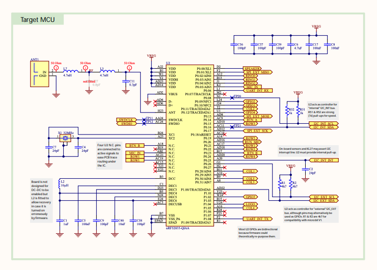

# Blink in Rust

_This program is ran on the [Microbit V2 board](https://tech.microbit.org/hardware/schematic/#overview)_

A few months ago in May, I decided that I no longer want to pursue fullstack development. It just didn’t become fun to me anymore as the space just felt like it was getting more and more crowded with wrappers of the major cloud providers. Abstractions on top of abstractions made me feel sick. So, I decided to go deeper into the devices that we use and travel down to the world of systems programming, and then eventually into embedded systems.

I specifically chose embedded systems because it lies on the line between going into Electrical Engineering and Physics (which I would prefer not to deal with) and the world of software.

So, that brings us to this article in my blog, which is writing embedded Rust.
> Why Rust you might ask? I’ve done some programming in C++ and I don’t like the ergonomics of it. I specifically chose Rust because it feels better and more aligned with how I want to work just like how you choose which web browser you want to work with.

**The Major Takeaway of What I Learned:**
You control the state of different board peripherals by driving the state of different pins on the microcontroller and modify the contents of the microcontroller registers.

For example, see the schematic of the Microbit V2 MCU below:


If you take a look at their [online schematics](https://github.com/microbit-foundation/microbit-v2-hardware/blob/main/V2.00/MicroBit_V2.0.0_S_schematic.PDF), you’ll see that you control the peripherals of the board by driving the state of the pins on the MCU (which is a [nRF52833](https://docs.nordicsemi.com/bundle/ps_nrf52833/page/keyfeatures_html5.html), I was using v1.6).

If you don’t understand, let’s look at some code.

**Code with some breakdown:**
```rust
#![no_std]
#![no_main]

use core::ptr::write_volatile;

use cortex_m::asm::nop;
use cortex_m_rt::entry;
use panic_halt as _;
use rtt_target::{rprintln, rtt_init_print};

#[entry]
fn main() -> ! {
    const GPIO0_PINCNF21_ROW1_ADDR: *mut u32 = 0x5000_0754 as *mut u32;
    // address of PIN 21
    const GPIO0_PINCNF28_COL1_ADDR: *mut u32 = 0x5000_0770 as *mut u32;
    // address of PIN 28
    const DIR_OUTPUT_POS: u32 = 0;
    const PINCNF_DRIVE_LED: u32 = 1 << DIR_OUTPUT_POS;
    // this is called bitmasking
    // it is necessary since the direction bit could be at a position other than 0 (1 or 2)
    // what this means: setting the direction as 0001 in this case works, but if the
    // direction position is at 1, then that means you have to set it to 0010

    unsafe {
        write_volatile(GPIO0_PINCNF21_ROW1_ADDR, PINCNF_DRIVE_LED);
        write_volatile(GPIO0_PINCNF28_COL1_ADDR, PINCNF_DRIVE_LED);
        // this is setting the VALUES at these memory addresses to '1'
    }
    const GPIO0_OUT_ADDR: *mut u32 = 0x5000_0504 as *mut u32;
    const GPIO0_OUT_ROW1_POS: u32 = 21;
    let mut is_on: bool = false;

    rtt_init_print!();
    rprintln!("Starting...");

    loop {
        unsafe {
            write_volatile(GPIO0_OUT_ADDR, (is_on as u32) << GPIO0_OUT_ROW1_POS);
        }
        for _ in 0..400_000 {
            nop();
        }
        is_on = !is_on;

        if is_on {
            rprintln!("ON");
        } else {
            rprintln!("OFF");
        }
    }
}

```
**Another program**
_this program creates a little LED lightshow that goes back and forth_
```rust
#![no_std]
#![no_main]

use core::ptr::write_volatile;

use cortex_m::asm::nop;
use cortex_m_rt::entry;
use panic_halt as _;
use rtt_target::{rprintln, rtt_init_print};

#[entry]
fn main() -> ! {
    const GPIO0_PINCNF21_ROW1_ADDR: *mut u32 = 0x5000_0754 as *mut u32;

    const DIR_OUTPUT_POS: u32 = 0;
    const PINCNF_DRIVE_LED: u32 = 1 << DIR_OUTPUT_POS;

    const COLUMNS: [*mut u32; 5] = [
        0x5000_0770 as *mut u32, // COL 1
        0x5000_072C as *mut u32, // COL 2
        0x5000_077C as *mut u32, // COL 3
        0x5000_0A14 as *mut u32, // COL 4, P1 (0x50000300); PIN 5 (0x714); 0x50000300 + 0x714
        0x5000_0778 as *mut u32, // COL 5
    ];

    unsafe {
        // configure pins to go OUT
        write_volatile(GPIO0_PINCNF21_ROW1_ADDR, PINCNF_DRIVE_LED);
    }
    const GPIO_OUTSET_ADDR: *mut u32 = 0x5000_0508 as *mut u32;
    const GPIO0_OUT_ROW1_POS: u32 = 21;
    let mut direction: i32 = 1;
    let mut curr_index: i32 = 0;

    let delay_speed = 25_000;

    rtt_init_print!();
    rprintln!("Starting...");

    loop {
        unsafe {
            write_volatile(GPIO_OUTSET_ADDR, 1 << GPIO0_OUT_ROW1_POS);

            for i in 0..COLUMNS.len() {
                write_volatile(
                    COLUMNS[i],
                    ((i as i32 == curr_index) as u32) << DIR_OUTPUT_POS,
                );
            }
        }

        curr_index += direction;
        rprintln!("{}", curr_index);

        for _ in 0..delay_speed {
            nop();
        }

        if curr_index == 4 {
            direction = -1;
        } else if curr_index == 0 {
            direction = 1;
        }
    }
}
```
And that's it! You can check out a demo of it all working [here](https://x.com/krayondev/status/1974552462356091192).

_Written with ❤️ by Krayon_  
Follow me: [x.com/krayon](https://x.com/krayondev)

