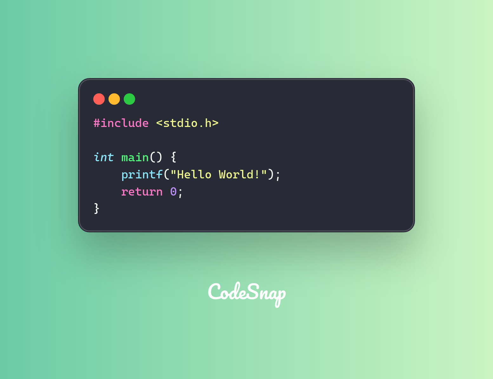

# Breaking Down "Hello World"
We can all universally agree that making a “Hello World” program is a canon event for all programmers and is arguably a rite of passage.

At a glance, this program is extremely simple with it being only **6 lines of code.**


## But, what if we went deeper?
```
.global _main
.align 2

_main:
    mov x0,  #1            // define WHERE to write data to (stdout in the terminal)
    adr x1,  helloworld    // load the ADDRESS (not the value) into the x1 register
    mov x2,  #14           // define the length of the message payload (14 bytes)
    mov x16, #4            // select the syscall for "write"
    svc      #0x80         // execute system call using Supervisor Call - software interrupt

    mov x0,  #0
    mov x16, #1
    svc      #0x80

helloworld:
    .ascii "Hello, World!\n"
```
If you don’t know assembly, don’t worry. I’ll explain what is going on here:
1. move (`mov`) the integer value 1 into the [CPU register](https://www.notion.so/What-is-a-CPU-Register-293b898d9b9e8028b8b9d0b3f698563c?pvs=21) x0 to specify where the program will be writing data to - which is the `stdout` file descriptor
2. load the address of the `helloworld` ASCII data location into the x1 register
3. specify the length of the message payload (which is 14 bytes) to register x2
4. select the system call trap for “write”, which is 4, by writing the value 4 to the x16 register
5. execute the system call using a Supervisor Call
6. and then the rest of the code is just to return 0

Cool! But we can go even deeper...

## Wtf is `stdout` and why are we writing to it

`stdout` (otherwise known as standard output) is a stream where programs write their regular output to. By default, it goes to the terminal or console, but it can be redirected to files or piped into other programs.

In the context of us running the program above (which is through the terminal), we are using `stdout` to write to the TTY/PTY devices (like `/dev/pts/N`**)** on Linux.

Our terminal emulator (which we are using) then reads the PTY data and renders it as text and graphics.

That’s the end! Thanks for reading.

_Written with ❤️ by Krayon_  
Follow me: [x.com/krayon](https://x.com/krayondev)
