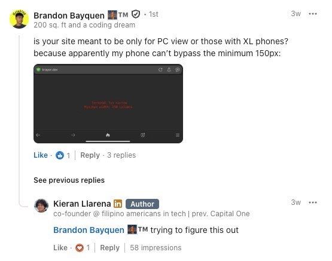
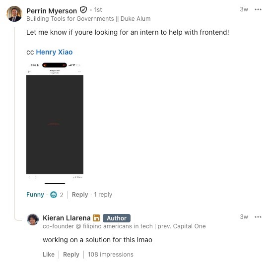
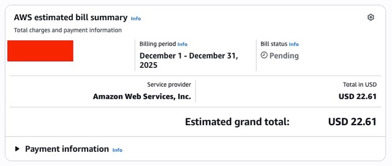
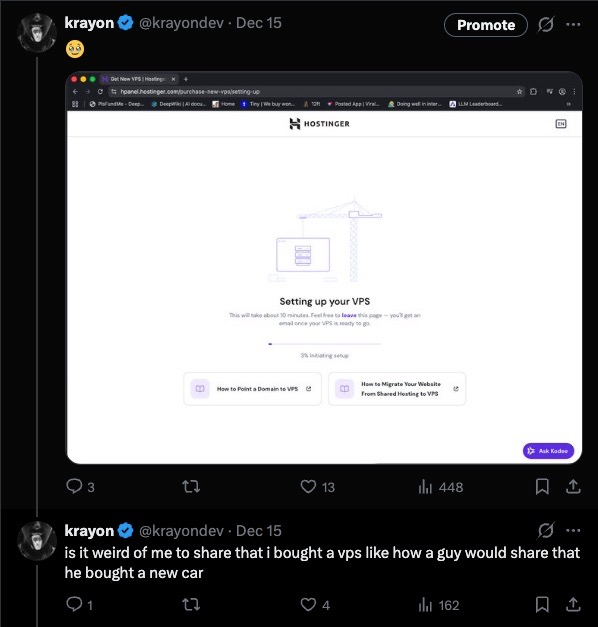

# Deploying a Portfolio over SSH Was a Mistake
_A follow up post on my blog post “Deploying a Portfolio over SSH”_

## Recollection

A few months back, from October to November (2025), I decide to revamp my personal website that I made two years ago and develop an ssh-focused portfolio. I’m not going to go in-depth on it since I wrote on how I did it in one of my previous blog postings called [Deploying a Portfolio over SSH](/).

The purpose of this article is to highlight some mistakes I made along the way, how I fixed them and how I’m going to fix them, which by the time you’re reading this will probably have been implemented.

## Issue 1

If you’ve viewed the website version of my portfolio yourself, you might have noticed that it’s not viewable on mobile. This was not a mistake and was deliberately planned.





I received a LOT of comments saying that my website wasn’t viewable on mobile

My thought process was simple: if you’re viewing my portfolio on your phone, you’re probably not paying that much attention to my portfolio so I’ll just filter you out. I thought this thinking was sound until I realized, it really isn’t.

### My Planned Fix

Typically, I would implement a mobile view for the website. However, this wouldn’t do much. If you’ve played around on the website by quitting the TUI, you’ll see that this is an actual machine running in your browser (not natively in the browser but over the internet). So, when you’re navigating around my portfolio, you’re actually using a TUI program. This is problematic for mobile since even if I do implement a mobile view, you wouldn’t be able to control the TUI app!


So, my fix for this is to just make the [krayon.dev](http://krayon.dev) website the [Deploying a Portfolio over SSH](/) blog post, sort of similar to how [terminal.shop](http://terminal.shop) does it where they don’t show you the actual shop, but explain how to access it.

## Issue 2

AWS started jacking up my bills.


Now these costs aren’t really that much but this made me pretty annoyed since I was trying to keep the costs minimal. They also made me pretty uncomfortable since the prices between the two months were not consistent.




### My Fix

While I could’ve just gone with a Reserved Instance or a Savings Plan, I just decided to purchase my own VPS from Hostinger, purchasing a 2 year plan for their their KVM 2 machine. Personally, I think this was a worth while purchase since it gave me as much performance as the EC2 “free tier” machines, much more storage space, and the ability to finally learn how to deploy to VPS. The monthly cost would also be SIGNIFICANTLY less than my previous EC2 costs, coming to about $6.74 thanks to Hostinger’s deals and the DREAMSOFCODE 10% off coupon code from the goat Dreams of Code.



If you’d like to get your own Hostinger machine for 20% off, feel free to use my [invite code](https://hostinger.com?REFERRALCODE=VHWKIERANZTT).

## Issue 3

My ssh server was not redundant so when it crashed, it would be completely down since there wouldn’t be any other replicas to take it’s place nor was there any self-healing.


### My Fix

[Docker Swarm!](https://docs.docker.com/engine/swarm/)

I chose Swarm mode over K8s because of simplicity. I was just trying to do some horizontal scaling with some auto-healing (which comes by default) and not have to learn k8s (I know that this is a lazy excuse but Swarm is more than good enough for this job). Swarm has auto-healing, blue-green deployments, replications, and the power of compose files, which is my favorite part since I can just write a file that looks like this:
```docker
services:
  reverse-proxy:
    image: traefik:latest
    command:
      - "--providers.docker"
      - "--providers.docker.exposedbydefault=false"
      - "--entryPoints.websecure.address=:443"
      - "--certificatesresolvers.myresolver.acme.tlschallenge=true"
      - "--certificatesresolvers.myresolver.acme.email=baymax709@gmail.com"
      - "--certificatesresolvers.myresolver.acme.storage=/letsencrypt/acme.json"
      - "--entrypoints.web.address=:80"
      - "--entrypoints.web.http.redirections.entrypoint.to=websecure"
      - "--entrypoints.web.http.redirections.entrypoint.scheme=https"
    ports:
      - mode: host
        protocol: tcp
        published: 80
        target: 80
      - mode: host
        protocol: tcp
        published: 443
        target: 443
    volumes:
      - letsencrypt:/letsencrypt
      - /var/run/docker.sock:/var/run/docker.sock
  portfolio-web:
    image: http-portfolio:latest
    labels:
      - "traefik.enable=true"
      - "traefik.http.middlewares.portfolio-web-ratelimit.ratelimit.average=20"
      - "traefik.http.routers.portfolio-web.rule=Host(`krayon.dev`)"
      - "traefik.http.services.portfolio-web.loadbalancer.server.port=7681"
      - "traefik.http.routers.portfolio-web.entrypoints=websecure"
      - "traefik.http.routers.portfolio-web.tls.certresolver=myresolver"
      - "traefik.http.routers.portfolio-web.middlewares=portfolio-web-ratelimit"
    deploy:
      replicas: 3
      restart_policy:
        condition: on-failure
      resources:
        limits:
          cpus: "0.50"
          memory: 1GB
    stdin_open: true
    tty: true
  file-server:
    image: nginx:alpine
    volumes:
      - ./static-files:/usr/share/nginx/html
    labels:
      - "traefik.enable=true"
      - "traefik.http.routers.files.rule=Host(`krayon.dev`) && (Path(`/robots.txt`) || Path(`/llms.txt`))"
      - "traefik.http.services.files.loadbalancer.server.port=80"
      - "traefik.http.routers.files.entrypoints=websecure"
      - "traefik.http.routers.files.tls.certresolver=myresolver"
volumes:
  letsencrypt:
    driver: local
```
enter the following command in my CLI:
```bash
docker stack deploy -c docker-compose.yml http_portfolio
```
and then instantly have 3 container replicas with load balancing and HTTPs (thanks to Traefik) with minimal config instead of doing the whole Nginx and Certbot setup process, which I am not a huge fan of. If you’d like to learn more about Docker Swarm for your own VPS, I highly recommend checking out and Dreams of Code’s tutorial series on deploying to VPS:
- [Setting up a production ready VPS is a lot easier than I thought.](https://www.youtube.com/watch?v=F-9KWQByeU0)
- [docker stack is my new favorite way to deploy to a VPS](https://www.youtube.com/watch?v=fuZoxuBiL9o)

And that’s it!

_Written with ❤️ by Krayon_  
Follow me: [x.com/krayon](https://x.com/krayondev)

