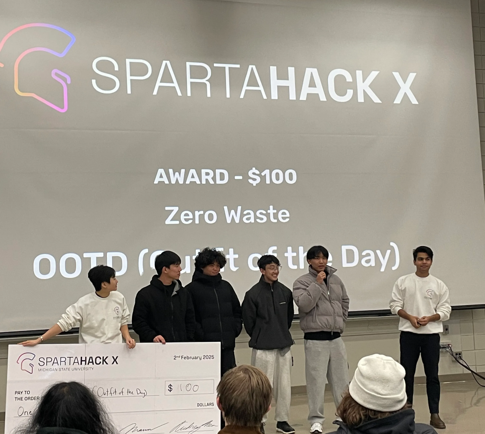
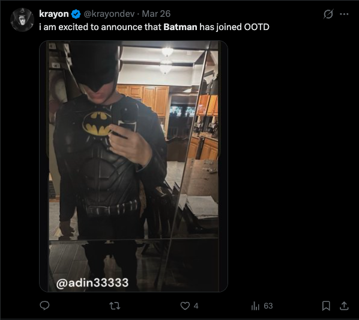
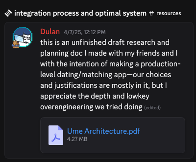
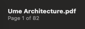
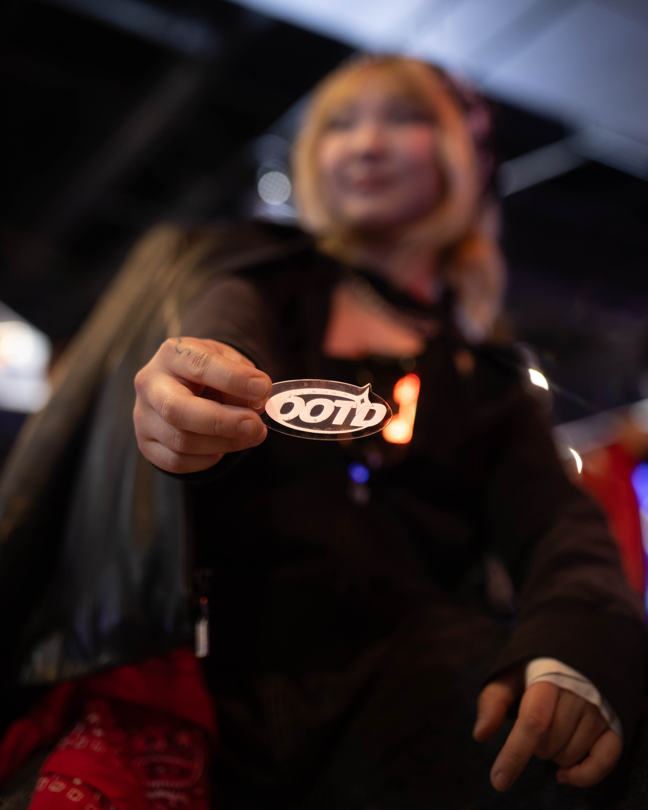
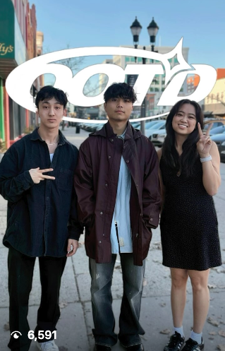
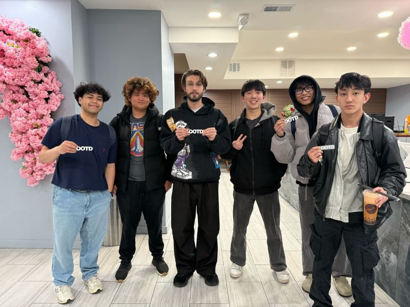
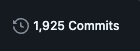
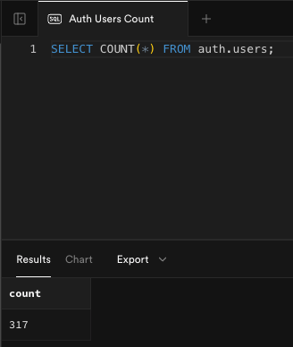

# Failing My First Mobile Consumer App Startup

*And what it taught me*

# 🆕 The Start

[OOTD](https://www.joinootd.com/) was born on February 2nd, 2025 when a [Top 500 Magik](https://marvelrivals.fandom.com/wiki/Magik), an electrical engineer, a film maker, and a college DJ combined forces to compete in [SpartaHack X](https://spartahack-x.devpost.com/), Michigan State University's annual hackathon.

The hackathon idea of OOTD started out as simple: make [Dress to Impress](https://playdresstoimpress.com/) in real-life. But as we prepped for the competition, we refined the concept into something closer to [Styl](https://www.dukechronicle.com/article/duke-university-styl-online-clothes-shopping-students-startup-tinder-20240201) (the “Tinder for Clothes” app where you could swipe left/right on an infinite feed of personalized clothing suggestions and swipe up to add the item to your cart) with a few other features like virtual-try ons and a digital collection of your liked outfits to digitize your wardrobe, all with the added fun twist of being able to win the *Outfit of the Day*.

On the day of the hackathon, after DJing a party in Ann Arbor (and even working on the idea at the party) and driving an hour up to East Lansing at 2am to finish and pitch the project, we somehow ended up winning! You can view the demo [here](https://devpost.com/software/ootd-outfit-of-the-day).

<video width="640" controls>
  <source src="IMG_0636.mov" type="video/mp4">
  Your browser does not support the video tag.
</video>

<video width="640" controls>
  <source src="IMG_0669.mov" type="video/mp4">
  Your browser does not support the video tag.
</video>

> *A series of events all happening under 24 hours.*
>

# ⏭️ Post-Spartahack, Alpha launch

My friends and I had no intention of continuing to work on this app after SpartaHack, but something weird happened. Random people at our schools learned about the app and began approaching us in-person to try it out.

Seeing signal here, we collectively decided to start working on putting the app into production. In just a couple of weeks, we put the app up on TestFlight and began our Alpha launch.

We opened the TestFlight app to a small group of 15 people and saw some good retention, daily posts and engagements from everyone for ~2 weeks straight. We also ended up having a lot of fun! So much in fun in fact that we ended up adding 15 more people, garnering a total of 30 testers. Here’s a funny picture of some guy dressed up as Batman on the app.

*Link to post [here](https://x.com/krayondev/status/1904913136089440702?s=20).*

## Social conformity is cool

One cool hack that I had discovered along the way for increasing engagement in mobile apps were push notifications.

When the Alpha first released, push notifications had not been implemented. Retention declined from 15 people to 5 in the first week (before we added 15 more ppl), but after implementing a system that would send a push notification to everyone when someone posted, it shot back up to 15 DAU (daily active users).

While its not related to social networks, I highly recommend watching the episode on Larry’s Podcast where he brings on Jackson Shuttleworth (Group PM on the Retention Team now Director of Product Management at Duolingo) to talk about how [he uses push notifications and streaks to increase user retention at Duolingo](https://www.youtube.com/watch?v=_CCwoQZH5hI).

## Back to our regularly scheduled program

After the hype around our Alpha released started to die down, we decided to refresh with a facelift. So we hit up a [mutual friend](https://www.justinlagmanux.com/) to onboard and upgrade our aesthetics.

At this point, we began to formalize things like our roles and monetization plan. I took on the role of CTO and "CEO" (in quotes because we just needed someone on paper for the Delaware C Corp, and I believed we could all collectively steer the ship, though I was mainly the one guiding the team) and laid the groundwork to sell ad space on the app.

In this transition time between the Alpha and the Beta, I took this formalization pretty seriously. I began conversing with friends about the app and how we could design it to be as technically sound as possible while also being able to develop quickly. One of these friends even sent me an 80+ page document on the system design specification of a technically similar app that they were trying to build.

We also got to speak to some significant figures like Nathan Anh (the CTO of [swsh](https://www.joinswsh.com/)) and [Alexa Kayman](https://www.alexakayman.com/) (prev. Head of Ops for [Bloom](https://bloomapp.com/) and current CRO for [Cluely](https://cluely.com/)).

# 🅱️ eta version

We launched the new shiny beta version in July 2025 with the added features of being able to create different groups, think Snapchat stories where you can create an arbitrary amount of stories and add certain people to them to restrict who can see them. We did this since people would start to slow down on posting as the in user base increased. We asked our users why, and the consensus was clear: they were uncomfortable with the idea of strangers seeing what they were posting.

So we used the idea of groups, all with the option to create a: public group (its open to the public to join and listed on the global list of groups in the app), private groups (invite only and listed on the global list of groups in the app), secret groups (invite only and not listed on the global list of groups in the app).

Upon launch, we had 100 new users sign up. Nice!

But sadly, a majority of them churned. If my math is correct, it was ~95% as after a few days, only ~5-8 people kept using the app daily.

This is when I started learning more about the idea of [flywheels](https://amplitude.com/guides/flywheels-playbook#what-product-flywheels-are-how-they-function), and devised this plan:

*users post → votes/posts accumulate OOTD points → spend OOTD points on store discounts → buy more clothes → post more*

> *Note: this flywheel replaced our ad space monetization plan, which was also abandoned because we had ran into a source that said we needed 50k MAU to qualify for ad space. However, from what I am researching now currently as I write this post-reflection blog post, is that we made a lapse in judgement since I cannot find this source and I am seeing other sources saying that we could have just used [Google AdMob](https://admob.google.com/home/) with the amount of users we had. So, oops!*
>

Also, at this point, we had pivoted around 5 different times before getting here:

1. Tinder for Clothes + virtual try-on + in-app store + digital wardrobe
2. Tinder for Clothes + digital wardrobe

    > *Note: we dropped virtual try-on because none of us were ML engineers and didn’t want to compete with the likes of [Google](https://blog.google/products/shopping/how-to-use-google-shopping-try-it-on/) and we dropped the in-app store because we didn’t want to build out same infrastructure as the TikTok shop*
    >
3. Tinder for Clothes + BeReal + digital wardrobe

    > *Note: we added the idea of BeReal to the marketing since that’s what people had thought our app was upon first glance*
    >
4. Tinder voting + BeReal + digital wardrobe

    > *Note: we dropped the “Tinder for Clothes” and only kept the voting since we didn’t want to create an algorithm for the app, at least at that point*
    >
5. 5 star voting + BeReal + digital wardrobe

    > *Note: we switched from Tinder voting to 5-star voting because people kept mistaking our app for Tinder at first glance*
    >

# 📜 Growth and sidequests

- Our [Instagram](https://www.instagram.com/ootdfashn/) grew to 552 followers and over 3 million views (on all platforms)
- We bootstrapped $200+ from selling merch
- We got to demo the app to bbno$ and Joon
- We organized some local events, including a Jollibee popup and a number of photoshoots that totaled to over 40 attendees
- Two of us flew to LA to attend UCLA Anderson's Pitch Deck workshop led by Ahmed A. Mirza (and to also get seaside)
- Took care of one of the steps in the app flywheel by successfully landing a partnership with [Vostretti](https://www.instagram.com/vostretti/)
- Got to table at the V1 @ Michigan Build Blue Demo Day and Kickoff

<video width="640" controls>
  <source src="9lsNZtokF5KhJbdH.mp4" type="video/mp4">
  Your browser does not support the video tag.
</video>

# 🤔 Reflections

### A New Chapter

After almost 2000 commits and 300+ created profiles, OOTD has unfortunately died and in a way that many startups end up dying: **by suicide**.

I would like to highlight that there were no co-founder related issues and I’m happy there wasn’t. While we did have a few hiccups, nothing drastic ever occurred to cause a rift between all of us. In fact, we are all still friends to this day.

To fully explain how the initiative ended up dying, we pretty much made most of the mistakes detailed in this [blog post](https://leohliu.substack.com/p/how-i-failed-a-startup-a-post-mortem) (s/o Leo for his transparency).

"we didn't want to do enough" fully encapsulated how the team felt about the app, leading us to call it quits. If you read the flywheel earlier, you can probably spot a glaring issue: we weren't solving a real problem. I didn't talk to people about the issues they actually faced, I just thought about it and assumed it would work. To make things worse, we also pigeonholed ourselves into building a two-sided marketplace, and if you want to understand how hard this is, just look at the stories of Uber, DoorDash, and Airbnb.

Going back to the “we didn't want to do enough”, we could have worked on finding an actually good working flywheel for the app, but we all eventually just wanted to do different things. To add to this issue, personally for me, I simply didn’t care about gamifying fit checks and I certainly didn’t want to carry the narrative that I did. I had only stayed for so long because of the problems that there were to solve.

Stuff like figuring out how to organize and architect an app that scales, how to work in a team setting where we’re all working towards going from 0 -> 1, learning how to manage other people, and then learning more about how to optimize small little things in an app to improve churn were brain candy to me, and felt amazing to solve. Additionally, I loved learning about how other people solved these problems.

This was also a time where I learned that it is harder to become a good engineer than it is to become a good businessman (I’ll talk about this another time but I’ll die on this hill), which is something that I want to become first before becoming a good businessman.

All of this is not to say that I am going to leave the startup space completely. I’ll still be around the scene, especially because I absolutely love how chaotic it is out here and how much ownership is given to the engineers.

### Improvements

If we had continued working on the app, I would’ve added all of these improvements:

- A smart notification system that were optimized to get you to keep engaging with the app
- Logins through texted OTPs
- Followers, messaging chats, etc. (all of the things that come by default for social media apps)

### A Word of Caution

Going back to our Alpha launch of our app, I went through a lot of pain:

- Developed a fever from stress **3 different times**
- Stayed up till 5am one night debugging on a school day (was working on some UI fixes till 4am and then the DB literally crashed as soon as I was about to go to bed)
- Poured energy into working to avoid some personal stuff
- All in all, slacked on my health

So this is a message to all young entrepreneurs who are just starting their journey: [building a startup is not a race](https://www.mintlify.com/blog/its-not-a-race). The most important and foundational thing that you will ever work on is your physical and mental health as it is the infrastructure of your output.

That’s all! If you’d like to chat, feel free to DM me on Twitter.

Also, if you’re a student that’s interested in this sort of stuff, you should checkout [V1 @ Michigan](https://www.v1michigan.com/).

# Helpful Resources

Other helpful resources and people I would like to recommend for those wanting to try out mobile consumer apps:

## Non-Technical

- [Nikita Bier’s 10 year reflection](https://x.com/nikitabier/status/1481118406749220868?s=20) (and Nikita Bier in general)
- [@_eth0n](https://x.com/_eth0n) (especially [this](https://x.com/_eth0n/status/1964392899350843849?s=20) post)
- [The 17-Year-Old Who Built a $1.12M/Month Ai App | Zach Yadegari](https://www.youtube.com/watch?v=t0U3UREdjmo) (linking this here because he talks about his experience working with content creators and gives advice on doing so)
- [A hangout app that never went viral](https://justinguo.substack.com/p/a-hangout-app-that-never-went-viral-f59385d55578)
- [Access to Capital: Building an Investable Pitch Deck with Ahmed Mirza](https://ucla-anderson.hosted.panopto.com/Panopto/Pages/Embed.aspx?id=07e6590b-99c6-472b-9220-b2c100f091cf)

## Technical

- [Expo](https://expo.dev/)
- [Convex](https://www.convex.dev/) (this is SOOOO much better than Supabase. Do note that you’ll need a separate auth provider)
- [Cloudflare](https://www.cloudflare.com/) (I could endlessly glaze Workers, CDN, and S3. 100% free egress/ingress! The whole Cloudflare ecosystem is awesome)
- [Vexo](https://www.vexo.co/)
- [Mobbin](https://mobbin.com/)
- [Adding Google Admob to Expo Apps](https://dev.to/josie/adding-google-admob-to-expo-apps-2din)
- [Zustand](https://zustand.docs.pmnd.rs/getting-started/introduction)
- [Share images from Your Expo React Native App to Instagram Stories](https://blog.vikrantbhat.com/a-step-by-step-guide-to-share-images-from-your-expo-react-native-app-to-instagram-stories)

*Written with ❤️ by Krayon*  
Follow me: [x.com/krayon](https://x.com/krayondev)

