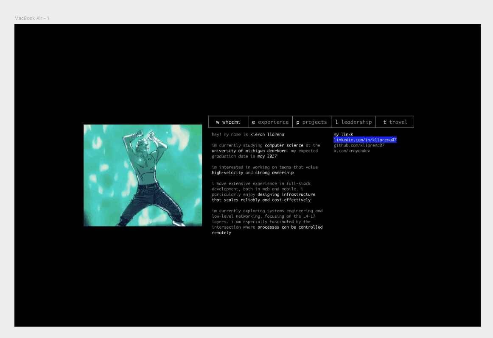
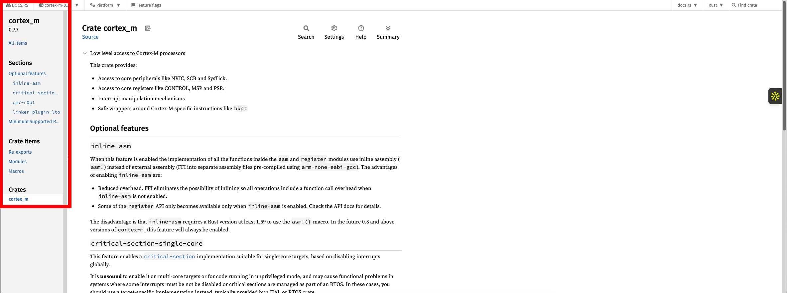
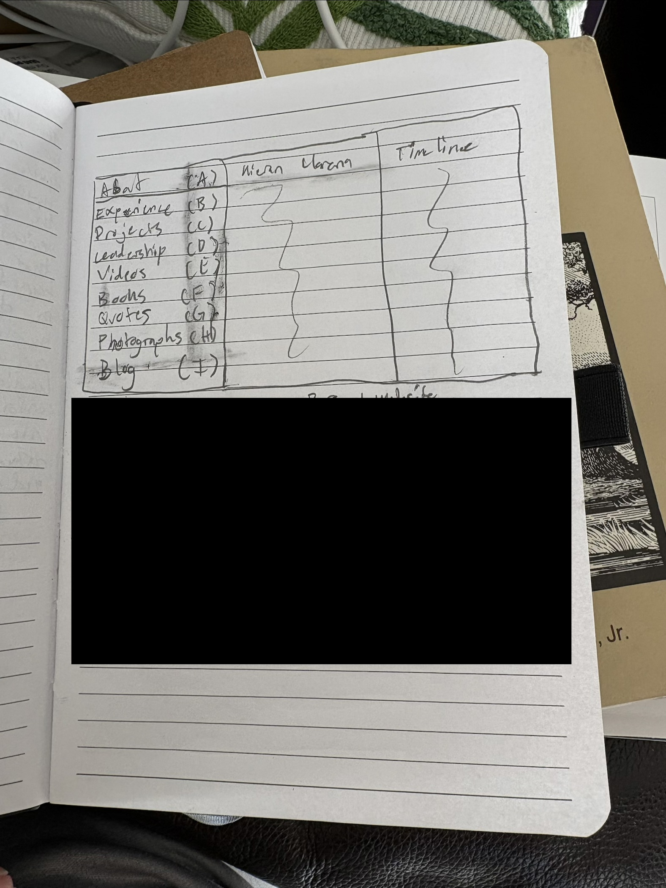
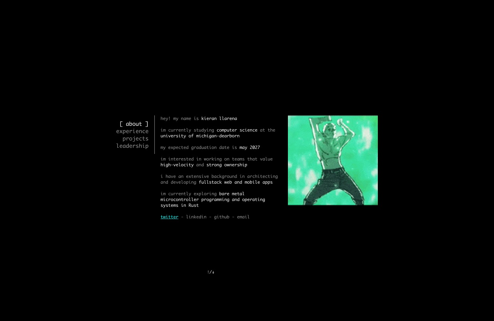

<span style="color: red; font-weight: bold;">If you're here to look at my portfolio, please visit `ssh krayon.dev` in your terminal.
</span>

# Deploying a Portfolio over SSH

_How I made `ssh krayon.dev`_

## 🌱 Origins

I made my first personal website nearly two years ago, with commits dating back to December 2023. The goal behind it was to make something that was unique to me but also something that just worked since I had realized that I was late to the recruiting season and needed something to present.

So, I put together something quickly (from Figma to code in around a week) and came up with the website you’re seeing below - at least a single page of it.


_Screenshot of [kieranllarena.com](http://kieranllarena.com). NOTE: this domain is expired._

It worked, but as time passed as I went on my 20-hackathons-in-a-year journey and other various different ventures, it soon became very outdated. I sought a change.

## 🧠 Brainstorming

Doing this revamp was a long process. I’ve seen so many cool personal websites and portfolios over the years and didn’t want to get lost in the sea of personal websites that all look the same.

One thing that I really enjoy about looking at people’s personal websites is how they capture the persons personality. I’m not only getting to view the work that they’ve done but I’m also getting to learn who they are as a person - see [leohliu.com](http://leohliu.com).

So, I began to reflect on myself.

I realized I wanted to be someone who questions how systems work and truly dives deep into understanding them. When I first started building things, I didn't take the time to learn how tools like React worked from the ground up. It wasn't until this year that I gained clarity on how these pieces of technology operate under the hood and I found it fascinating.

So, I chose something most developers take for granted: the terminal. This idea was inspired  from my first `ssh terminal.shop` visit. I had no idea you could create something like this, and it opened my eyes to what was possible with software.

## ✏ Designing

I took around 10 days to think about and design what my portfolio would look like. This was the first iteration. I took inspiration from [terminal.shop](http://terminal.shop), [armank.dev](http://armank.dev), [armaan.cc](https://armaan.cc/), and [huang.bio](https://huang.bio/).



I liked how this looked but there was a problem: the UI was not scalable. It would be very difficult to add more pages since adding more meant the horizontal tab would end up getting cramped.

I thought about this and one day while I was scrolling through a Rust crate on the Rust docs, I realized I had found a solution to my problem: turn the horizontal tabs vertical.





I ended up with this final version and I think it’s pretty clean. Although some things have changed (like adding how to navigate on the side and the links section is completely different) this draft was good enough to start creating the program.

## 🔧 Forging

To make something similar to my portfolio, you only need two things:

1. a custom SSH server
2. a TUI (terminal user interface) program

I won't go in-depth on how I made my TUI (because you can watch [videos on YouTube](https://www.youtube.com/results?search_query=how+to+use+ratatui) for that) but I will talk about serving the TUI over SSH.

You may have noticed I said you need a custom SSH server. There's a specific reason: you cannot use OpenSSH because the engineers working on it are extremely smart and take security very seriously.

If you've used SSH before, you know you typically need either a password or a key file to connect to the server. But if you visit my portfolio site or [terminal.shop](http://terminal.shop), you'll notice neither is required. This means authentication is disabled on the SSH servers serving these TUIs. This is somewhat questionable since this theoretically could mean that you allow ANYONE to ssh into your sever, but can be patched by forcing anyone that accesses the server into the TUI program.

Great! So we just need to disable authentication on an OpenSSH server and we're all set, right? Not quite. You can configure your `/etc/ssh/sshd_config` to disable all authentication methods, but OpenSSH won't budge. The OpenSSH does not allow anyone to configure their OpenSSH server without authentication.

So, to get around this, we’ll have to use our own custom SSH server. For this task, I decided to use [russh](https://github.com/Eugeny/russh), a maintained fork of [thrussh](https://nest.pijul.com/pijul/thrussh).

From there, all you have to do is run the russh server and configure it to provide an interactive PTY upon request. Luckily, they provide an example of how to do this [here](https://github.com/Eugeny/russh/blob/main/russh/examples/client_exec_interactive.rs). After making some slight modifications to this configuration, you can make it so that the server serves a TUI over SSH and does this by sending escape sequences to your local terminal through the ssh connection.

```Rust
async fn channel_open_session(
  &mut self,
  channel: Channel<Msg>,
  session: &mut Session,
) -> Result<bool, Self::Error> {
  let (sender, mut receiver) = unbounded_channel::<Vec<u8>>();
  let channel_id = channel.id();
  let handle = session.handle();

  tokio::spawn(async move {
    while let Some(data) = receiver.recv().await {
      let result = handle.data(channel_id, data.into()).await;
      if result.is_err() {
        eprintln!("Failed to send data: {result:?}");
        break;
      }
    }
  });

  let terminal_handle = TerminalHandle::new_with_sender(sender);
  let backend = CrosstermBackend::new(terminal_handle);

  let options = TerminalOptions {
    viewport: Viewport::Fixed(Rect::default()),
  };

  let terminal = Terminal::with_options(backend, options)?;
  let app = App::new();

  let mut clients = self.clients.lock().await;
  clients.insert(self.id, (terminal, app));

  Ok(true)
}
```

A small code snippet of the russh server doing this. You can view the entirety of the source code [here](https://github.com/kllarena07/ssh_krayon.dev) on my GitHub.

After putting all of this together, deploying the server was as simple as setting up a VPC and running the program binary.

### Some Small Things to Note

- russh doesn’t work in Docker containers. I do not know why but every time I would try and connect to the server I would get this error: `ssh_dispatch_run_fatal: incorrect signature`. I think this may be related to some sort of cryptographic error when initializing the ssh connection. (**Edit (11/29/2025):** it turns out that having a proxy/forwarder in front of the server can affect the verification process on the client side! I found this out while trying to roll my own ssh server and was running into the same issue. I do not currently know what the fix is but I would recommend looking into it.
- I would recommend doing this in Go over Rust (terminal.shop wrote their program in Go) since the ecosystem is more mature
  - I was having some warnings when deploying my russh server that the crate would become deprecated in future Rust versions.
  - russh relies on the `rand_core` crate at version 0.6.4. `rand_core` is currently at version **0.9.3** (super out of date!)


_Written with ❤️ by Krayon_  
Follow me: [x.com/krayon](https://x.com/krayondev)
